### Requiremensts
sudo apt-get install imagemagick
(for generate gif, if you have error like "/bin/sh: 1: convert: not found", install it)

## 1st submission: Data Generation with matplotlib
npz and img are both done with matplotlib, which is slow, ready for test

utility:
1. data generation: "python cli_generate_data.py" 
2. train with npz: "bash train_sinus_npz_H.sh" or "bash train_sinus_npz_B.sh"
3. train with images: "bash train_sinus_img_H.sh" or "bash train_sinus_img_B.sh"

Quality:
Dataloader works
traing start succesfully

## 2nd submission: Data Generation with OpenCV
utility:
in cli_generate_data.py

Improvement: 20 times faster

## Result

| data_method       | what network sees         | generation time|
| ------------- |:-------------:|-------------:|
| *.png* with matplotlib     | 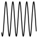 |137.42s
| *.npz* with matplotlib      | 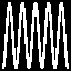|160.68s
| *.png* with openCV | 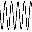     | 8.36s
| *.npz* with openCV | 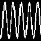     |11.51s

## Enviornment of Implementation
see [npz_requirements.txt](./npz_requirements.txt)

## 3rd submission: Inference Net
1. inference with images: 
"bash inference_sinus_img_H.sh" or "bash inference_sinus_img_B.sh"

2. Inference with npz: 
"bash inference_sinus_npz_H.sh" or "bash inference_sinus_npz_B.sh"

Notes:
- checkpoints provided are trained on GPU, which can be loaded both GPU or CPU, 

- visdom is toggled off in inference scripts provided.

- generated result can be seen under ./outputs/*

## 4th submission: Data with different Amplitute
1. plot sample for 0.5 to 5, step as 0.5

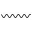
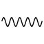
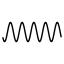
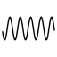

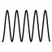
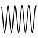

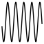
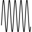

2. [cli_generate_data.py](./cli_generate_data.py) will generate 5000 samples
time will be 7-8 minutes for images with matplotlibs. and openCV is also adapt to amplitude unnormalized version.

#### generated training reselut

images with model H 10k iterations

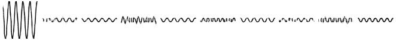
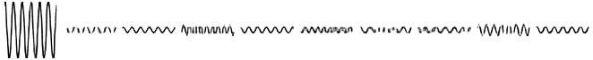
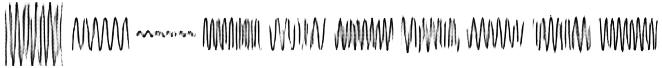

images with model B 10k iterations

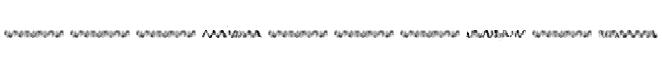

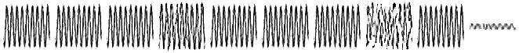

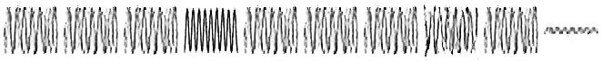

npz with model H 26k iterations

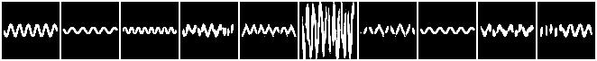

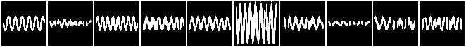

npz with model B 28k iterations

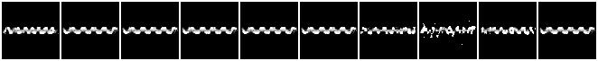

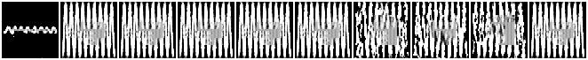

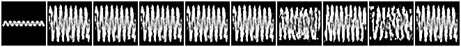

## 5th submission: Data Generation cosinus and length-4-output encoder 
#### data generation is updated:

|        | equation         | 
| ------------- |:-------------:|
| before     | y = a * sin( w*x )|
| now     | y = a * cos( w*x + b ) + c|

1. plot sample being more variant for cosinus with 4 parameters

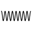
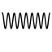
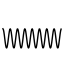
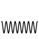
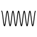

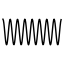
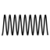

length-4-ouput encoder&decoder:
repalce the last layer of conv 256 with 4

1. training:
"bash train_sinus_img_H_4_nn.sh"
2. inference:
"bash inference_sinus_img_H_4_nn.sh"

result: because of convolution is based on pixel. this will be failed. it won't get the 4 parameter from the image by convolution layer.

______________________________________________________________

### troubleshooting
in Sovler.py

if you decide to load any images, the channels should be 3 in solver.py

self.nc = 3

### npz file

Pros:
most efficent, binary, like it does with dSprites.
also 1 channel, making great sense

Cons:
no visualization, no smoothing in lines

submission status: Done
Call: generate_train_npz(folder, N_type=100, amax=5, wmin=5, wmax=10, step = 0.1, wfreq=0.5 )

### use img

Pros:
visual and smoothing

Cons:
3 channels, treat Signal as greyscale image which doesn't necessary to be.
no semantic item in the images, like it does with 3d chair and celeb
doesn't make lots of sense

submission status: Done
Call: generate_train_img(folder, N_type=100, amax=5, wmin=5, wmax=10, step = 0.1, wfreq=0.5 )

### use OPENCV

Pros:
20 times faster, most efficient way to generate data

Cons:

no smoothing and inteplation when generate images. jagged edge

submission status: Done
Call: generate_train_npz_cv(folder, N_type=100, amax=5, wmin=5, wmax=10, step = 0.1, wfreq=0.5 )
and generate_train_img_cv(folder, N_type=100, amax=5, wmin=5, wmax=10, step = 0.1, wfreq=0.5 )

### output 4 as new network output dimension
input [-1, 3, 64, 64]

Conv2d-1           [-1, 32, 32, 32]

ReLU-2           [-1, 32, 32, 32]

Conv2d-3           [-1, 32, 16, 16]

ReLU-4           [-1, 32, 16, 16]

Conv2d-5             [-1, 64, 8, 8]

ReLU-6             [-1, 64, 8, 8]

Conv2d-7             [-1, 64, 4, 4]

ReLU-8             [-1, 64, 4, 4]

Conv2d-9              [-1, 4, 1, 1]

ReLU-10              [-1, 4, 1, 1]

View-11                    [-1, 4]

Linear-12                   [-1, 20]

Linear-13                    [-1, 4]

View-14              [-1, 4, 1, 1]

ReLU-15              [-1, 4, 1, 1]

ConvTranspose2d-16             [-1, 64, 4, 4]

ReLU-17             [-1, 64, 4, 4]

ConvTranspose2d-18             [-1, 64, 8, 8]

ReLU-19             [-1, 64, 8, 8]

ConvTranspose2d-20           [-1, 32, 16, 16]

ReLU-21           [-1, 32, 16, 16]

ConvTranspose2d-22           [-1, 32, 32, 32]

ReLU-23           [-1, 32, 32, 32]

ConvTranspose2d-24            [-1, 3, 64, 64]
