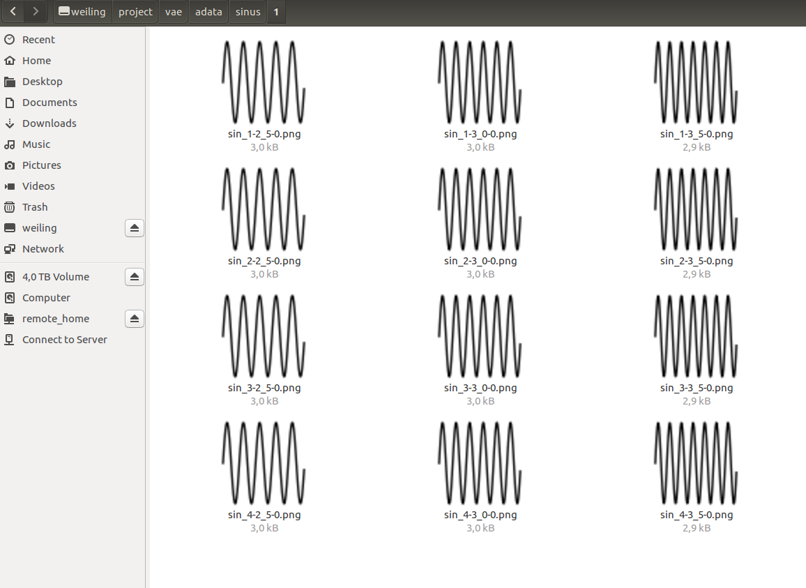
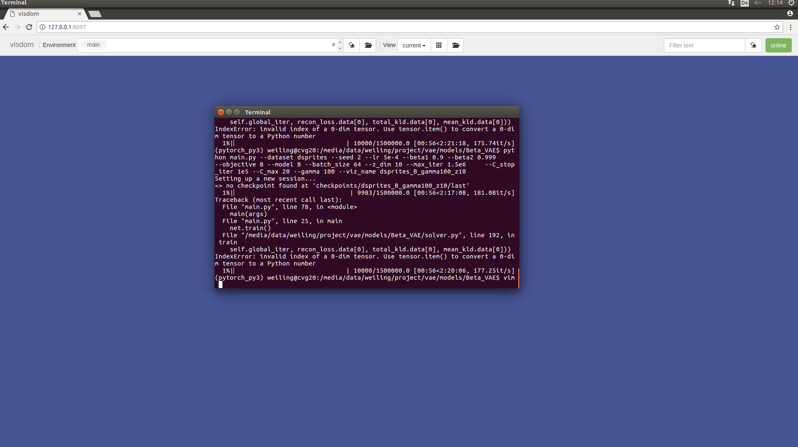
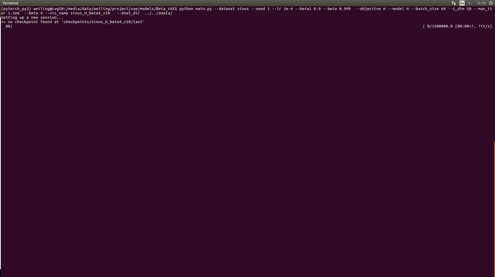

### first milestone

### step 1. generate data
#### 1.1 result


#### 1.2 troubleshooting
because f-string is only supported after **python 3.6**, and the lab machine of mine is having python 3.5
therefore I need to do wind back to format style in `util.py` medthod ` generate_train_img`  line 57
```
#filename = f'{folder}/sin_{amp_i}-{omega_ii}-{type_i}'.replace(".","_")
filename = '{folder}/sin_{amp_i}-{omega_ii}-{type_i}'.format(folder=folder, amp_i=amp_i, omega_ii=omega_ii, type_i=type_i).replace(".","_")
```

### step 2. do test of dsprites
#### 2.1 result


#### 2.2 troubleshooting
ConnectionError[Errno 111]
it is because of **visdom** server not up
```
python -m visdom.server
```

### step 3. do test of sinus
#### 3.1 result

#### 3.2 troubleshooting
RuntimeError: Found 0 files in subfolders of: `../../adata/sinus/` when png are just under the folder

it is a confusing **pytorch** issue, because of pytorch is recursively reading files in the folder, but actually will missing the root folder here.
for a training strucure as /sinus/subfolder/*.png it will be read properly but not /sinus/*.png

solution is making subfolder as /sinus/1/*.png and it is loaded.

reference: [RuntimeError: Found 0 images in subfolders of:](https://github.com/pytorch/examples/issues/236)

Weiling
experiment on 09.Dec.2019
report on 10.Dec.2019
